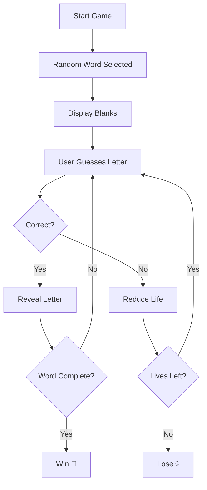

# 🎮 Hangman Game in Python


> 🎯 A fun CLI-based Hangman game to practice Python fundamentals

---

## 📖 Overview

**Hangman** is a classic word-guessing game where the player attempts to guess a hidden word one letter at a time.

The game starts with a series of blanks representing each letter of a randomly chosen word. The player inputs guesses, and:

* ✅ If the guessed letter is correct, it is revealed in all its positions in the word.
* ❌ If the guessed letter is incorrect, the player loses one life.

The game continues until one of the following happens:

* 🎉 The player correctly guesses the entire word (Win)
* 💀 The player runs out of lives (Lose)

### 🧩 Why Hangman?

Hangman is more than just a game — it’s a great way to practice:

* Logical thinking
* Pattern recognition
* Problem-solving skills

In programming, it helps beginners understand how to manage **state, loops, and conditions** effectively.

### 🎯 Objective

Guess the hidden word correctly before your lives run out by making smart letter guesses.

---

## ✨ Features

| Feature           | Description                              |
| ----------------- | ---------------------------------------- |
| 🎲 Random Word    | Selects a random word each time you play |
| ⌨️ User Input     | Interactive letter guessing              |
| ❤️ Lives System   | Limited attempts to guess the word       |
| 🎨 ASCII Art      | Visual hangman representation            |
| 🔁 Game Loop      | Runs until win or loss                   |
| 🧠 Smart Tracking | Keeps track of guessed letters           |

---

## 🧠 Concepts Used

* 🔁 Loops (`while`, `for`)
* 🔀 Conditional Statements (`if-elif-else`)
* 📚 Lists & Strings
* 🎯 Game Logic Design
* 📥 User Input Handling
* 🧩 State Management (lives, guesses)

---

## 🕹️ Gameplay Logic



---

## 🎮 Rules

* You can guess **one letter at a time**
* Each wrong guess reduces your ❤️ lives
* You win if you guess the word before lives reach 0
* You lose if all lives are exhausted

---

## 📷 Sample Output

```
_ _ _ _ _
Guess the letter: a
Lives left: 5
_ a _ _ _
```

---

## 🚀 Future Improvements

* ✅ Input validation (only single letter allowed)
* 🎚️ Difficulty levels (Easy / Medium / Hard)
* 🏆 Score tracking system
* 🖥️ GUI version (Tkinter / PyGame)
* 👥 Multiplayer mode
* 🗂️ Word categories (Animals, Fruits, etc.)

---

## 🛠️ Requirements

* Python 3.x
* Works on any OS (Windows / Linux / Mac)

---

## 🤝 Contribution

Contributions are welcome!

1. Fork the repo
2. Create a new branch
3. Make your changes
4. Submit a Pull Request

---

## 🙌 Acknowledgements

* Inspired by the classic Hangman game
* Built as part of learning Python fundamentals

---

## 📄 License

This project is licensed under the **MIT License**.

---

## 💡 Author

**Prem Kumar**
Made with ❤️ and logic 😄
